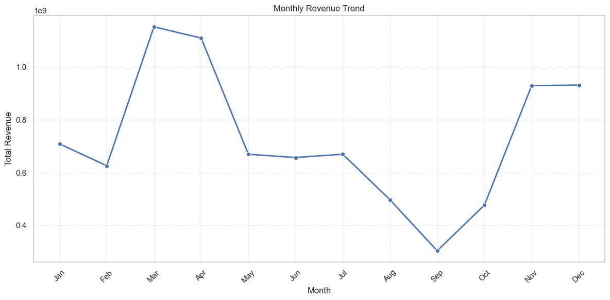

# **Sales & Operational Performance Analysis**

**Project Date:** June 30, 2025
**Author:** Ibukunoluwa Fodunrin

## **Executive Summary**

This report details the findings from an exploratory data analysis of **15,678 sales orders** from `2021-01-01` to `2023-08-05`. The goal was to uncover key trends in sales, customer behavior, and operational efficiency to provide data-driven recommendations for strategic growth.

Our analysis revealed several critical insights:
* **Strong Sales Core:** A small number of products and customers are responsible for a significant portion of our revenue.
* **Ineffective Discount Strategy:** Current discounts show a negligible correlation with sales volume, suggesting a need to re-evaluate our promotional tactics.
* **Data Integrity Gaps:** Incomplete data for sales representatives and customer locations limits our ability to perform a full performance analysis and identify regional opportunities.

This document outlines these findings in detail and proposes actionable recommendations to enhance sales strategies, improve operational efficiency, and strengthen data governance.

---

## **Key Insights**

Our analysis focused on several key business areas, yielding the following insights.

### 📈 **1. Sales & Revenue Performance**

* **Overall Revenue:** The company generated a total revenue of **₦8,731,822,000** across the analysis period.
* **Sales Trend:** Sales peaked in `Quarter 1 & Quarter 4`, with the lowest point occurring in `Quarter 3(September)`.
    

* **Profitability:** The overall profit margin was **17.08%**. The relationship between revenue and cost of goods sold (COGS) is perfectly linear, which is expected.

### 🥖 **2. Product Analysis**

* **Top-Performing Product:** The **"[Top Product Name]"** is the clear leader, accounting for **[Percentage]%** of total quantity sold and **[Percentage]%** of total revenue.
* **Product Portfolio:** The top **[Number]** products drive **[Percentage]%** of all sales, indicating a strong reliance on a few key items.
* **Underperforming Products:** Products such as **"[Lowest Selling Product]"** show minimal sales and may warrant a review for potential discontinuation.

    

### 👥 **3. Customer & Regional Insights**

* **Key Customers:** Our most valuable customer is **Brandenburg Multichoice**, who contributed **₦2,192,697,600** in revenue. The top **3** customers account for **73.9%** of total revenue.
    
    
    
* **Top Sales Region:** **Lagos** is our highest-performing region, generating **60%** of sales.
    
    
* **Data Gap:** Crucially, location data is missing for **1,148 orders (7.3%)**, preventing a complete geographic analysis.

### 🧑‍💼 **4. Sales Team Performance**

* **Top Sales Representative:** **"[Top Sales Rep Name]"** was the highest-performing sales representative, generating **₦1,468,122,000** in revenue.
    
    
* **Data Gap:** Sales representative information is missing for **1,307 orders (8.3%)**. This makes it impossible to assign credit for a significant portion of sales and accurately measure individual performance.

### ⚙️ **5. Operational Efficiency**

* **Discount Effectiveness:** Our analysis shows **no significant correlation** between the discounts offered and the quantity of products sold. This suggests that the current discount strategy is not an effective lever for increasing sales volume.
* **Payment Methods:** The most frequently used payment method is **"Bank Transfer"**, used in **50%** of transactions.
    
    
* **Delivery Times:** The average delivery time is **3 days**. There is **no significant** variation in delivery times across different locations.

---

## **Recommendations**

Based on the insights above, we propose the following actions:

1.  **Focus on Core Products & Customers:**
    * **Action:** Develop a key account management program for our top **[Number]** customers to ensure retention and satisfaction.
    * **Action:** Increase marketing efforts and ensure robust inventory for **"[Top Product Name]"** and other top-sellers.

2.  **Re-evaluate Discount Strategy:**
    * **Action:** Pause the current broad-based discount program.
    * **Action:** Design A/B tests for targeted promotions (e.g., volume discounts, bundled offers) on specific products or for specific customer segments to find what truly drives purchasing behavior.

3.  **Improve Data Collection & Governance:**
    * **Action:** Enforce mandatory data entry for the `sales_reps` and `location` fields at the point of order creation.
    * **Action:** This is a critical fix to enable accurate performance tracking, commission calculations, and targeted regional marketing.

---

## **Next Steps**

To build on this initial analysis, we recommend exploring the following:

* **Predictive Sales Forecasting:** Develop a model to forecast demand for key products to optimize inventory management.
* **Customer Segmentation:** Group customers based on purchasing behavior (e.g., frequency, value, product preference) to create more personalized marketing campaigns.
* **Root Cause Analysis:** Conduct a deeper investigation into why certain products are underperforming and why the current discount strategy is ineffective.